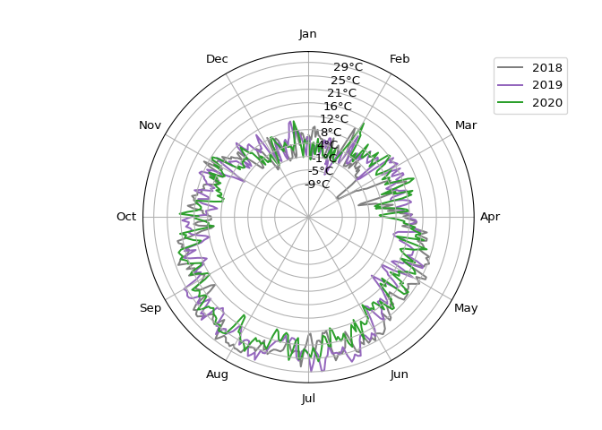

Examples
================

### Trends in monthly values as polar grid plot

``` python
import pandas as pd
import numpy as np
import matplotlib.pyplot as plt
from season_polar_plots import SeasonData

tw = pd.read_csv('ExampleTdata.csv', sep=',', converters = {'time': pd.to_datetime}, index_col = 'time')
twm = SeasonData(tw['t'], 1970, 2020, 'monthly')
twm.sp_plot('max', col='inferno', label='T$_{max}$ (°C)', off=5)
plt.yticks(color='white');
plt.show()
```

<!-- -->

##### Example: development Tmax in June:

``` python
import pymannkendall as mk

twm_data = twm.get_mgrid('max')
trend, h, p_mk, z, Tau, s, var_s, slope, intercept = mk.original_test(twm_data['Jun'])
print(trend, 'by', np.round(slope,2),'°C per year')
```

    ## increasing by 0.08 °C per year

``` python
plt.plot(twm_data['Jun'])
plt.ylabel('T$_{max}$ (°C) in June')
plt.show()
```

<!-- -->

### Shift in occurrence of extreme values

``` python
dt_f = lambda x: pd.to_datetime(x, format = '%d.%m.%Y')
qmax = pd.read_csv('ExampleQmax.csv', sep=';', converters = {'Date': dt_f}, index_col = 'Date')
q = SeasonData(qmax, 1977, 2021, t_res='daily')
q.sp_plot(mode='all', pmarker = 'X', nylabels=10,off=5, label = 'Q$_{max}$ (mm day$^{-1}$)', linreg=True)
```

    ## R2 = 0.4532333490820837, p_slope = 4.03910064180579e-07, p_intercept = 1.9616872564428065e-07

``` python
plt.show()
```

<!-- -->

### Von Mises-distribution of extreme values

``` python
q.von_mises(mode='all', col_hist='gray', col_vm = 'darkred')
```

    ## kappa = 3.2883144810091984, mu = 2.3126868005475236, mu_nday = 134

``` python
plt.show()
```

<!-- -->
